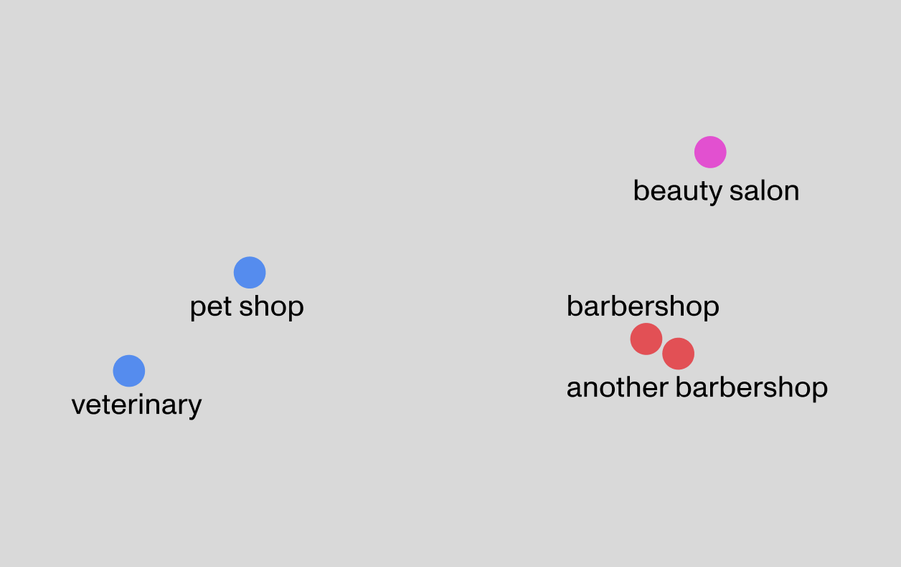
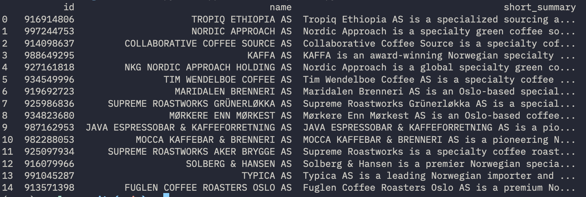
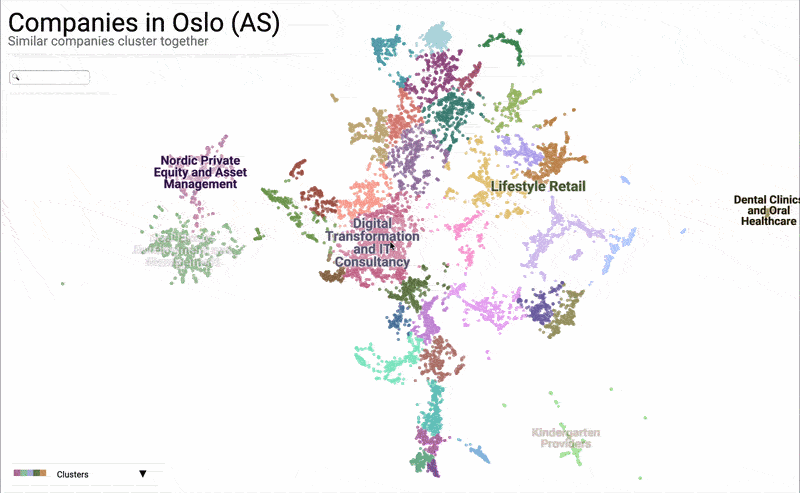

[View the map](https://timoteodomingos.github.io/lensa/)

### PIPELINE 

1. `01_load_brreg.py` — Load all companies from the Brreg dataset into DuckDB
2. `02_guess_website.py` — Search each company via DDGS, feed the top 20 results to an LLM, and return the most likely website with a confidence score
3. `03_scrape_website.py` — Scrape the homepage and about page if present
4. `04_generate_summary.py` — Generate a company summary from the scraped content and filter out false positives
5. `05_generate_embeddings.py` — Generate vector embeddings from the summaries
6. `06_reduce_dimensions.py` — Reduce embeddings to x,y coordinates using UMAP
7. `07_find_clusters.py` — Assign clusters and generate cluster labels
8. `08_get_financial_data.py` — Fetch financial data for each company from the Brreg API

---

I wanted to start off this README by explaining how I came across the brreg dataset (Norwegian chamber of commerce) and thought, *'wouldn't it be really cool if we could create a map where similar companies end up close to each other?'* - and how I then found out vector embeddings were the right tool for the job... But I would be lying: it happend exactly the other way around. 

See, when you have a nice hammer, everything looks like a nail. I've been enjoying applying vector embeddings to things for a while already, and in the Brreg dataset I found a good nail - Norway publishes nearly every company in the country as open data — something most countries either lock away or charge a small fortune for.

If you're unfamiliar with vector embeddings and how to compare similarity between vectors, [I've written an easy-to-digest explainer](https://github.com/timoteodomingos/lensa/blob/main/vector_embeddings_explainer.md) — one I hope anyone can follow regardless of technical background.

## The idea

The idea is to get a summary of every company's activity in Oslo, so we can create a vector embedding for each one. This alone lets us compare companies by similarity — you could ask which 10 companies are most similar to company X, or query something like "dog-friendly gluten-free bakery" and instantly get the most relevant matches.

We can take it a step further and try to put these 4096-dimensional embeddings on a 2D map. Maybe we'd get something like this, but with every company in Oslo on it:



I'm not sure how useful it would actually be, but I can imagine a few use cases — and surely there'd be value in being able to navigate information this intuitively, almost like a real map: getting a quick overview of who your competitors are, encoding revenue into dot size or color to compare companies at a glance, or spotting which industries dominate the Oslo economy from a bird's-eye view.

But before we break our brains over how to get 4096-dimensional embeddings onto a 2D map, let's first focus on getting these embeddings. Worst case, we end up with a solid query engine instead of a map.

## Getting summaries 

The Brreg datafile I mentioned earlier actually contains exactly this — a short description of each company's activity. But a quick example gives us a reality check:

When I look up Six Robotics, a company that makes software for military drones, I get:

```
Utvikle og selge systemløsninger og programvare for robotikk.
```

Not the worst summary you could imagine, but it's missing a lot — no mention of military, drones, anything specific. And this is just one example I happened to pull. With 80,000+ companies in Oslo, you can imagine these summaries often won't capture nearly enough detail.

So how do we get a proper summary for every company in Oslo? Maybe grab each company's website and get content from there? But out of our ~81,765 AS companies in Oslo, only around 7,000 have a website listed — and when I checked a few companies I know personally, none of them showed up. So most companies with a website just don't have it registered with Brreg.


## Farming our data 

There's a search API called `ddgs` — since regular search APIs are usually pretty pricey (~$400 for 80k searches), this one is a great alternative. It's a Python library that tries different search engines (Yahoo, Yandex, Brave, etc.) and returns results, like a Google search API, but free.

Since common wisdom says you should always try the naive approach first, I figured: take every company, search its name + address + city, grab the top 20 results, and mash the summaries of the results together into one.

This was a terrible idea. After running it on a sample, the embeddings came back nowhere close to actually similar companies. For most companies, most search results are just noise. And with second-tier search engines, We get Russian results, Chinese results all mixed in. Embedding models are pretty good at separating signal from noise, but this was pushing it way too far. There is also no way to tell which companies have clean data and which had garbage.


## The power of LLMs in data farming 

The best source of information about a company is its own website. To find the website, we could search each company, compare its name against the top 20 domains, do some keyword matching, and so on. But that's a lot of manual work and very error-prone.

A much better idea is to feed each company — name, activity, and location — along with its top 20 search results, into an LLM with a mildly threatening prompt:

```
Your job is to find the website of {company name} with {company activity} as activity and {address} as address. 

Out of the 20 search results below, select the domain which you think is most likely to be the website of the company, along with a confidence score (low/medium/high). 

{search results}

{the usual threats}
```

Modern LLMs can be made to return structured JSON, which makes this approach very robust — easy to parse and dump straight into the database. We then just keep the high-confidence results. A smaller model (~27B params) handles this perfectly well, and the cost for ~80k queries is basically nothing (under $15).

To check the quality, I ran this on companies where we _already_ knew the correct domain from the Brreg dataset. We got under 10% false positives, and over 80% success — most of the failures were just domains that no longer exist.

Of course there's always some risk of false positives, and that means some bad data. But we're not building a fault-tolerant, high-stakes system — just something good enough to compare most companies reasonably. And there are a couple of cleanup steps later that make false positives even less likely.

## Generating summaries 

Out of the 81,765 AS companies registered in Oslo, our approach found ~17,000 websites with high confidence. Considering most AS companies are holdings, subsidiaries, etc., and every company I personally know shows up in the results, I'd say this is a pretty good result. 

Now that we know each company's website, we can scrape the content (respecting robots.txt, of course) and feed it to an embedding model. There are great scraping libraries that just take a domain and hand you back the text content of a website. But every site is different, and some are full of noise — products, navigation, etc. So a better approach is to feed the scraped content to an LLM with a prompt like:

```
Your job is to generate a summary about Norwegian company {company name} from the content below.

company activity from chamber of commerce: {activity}

{website content}

If the company activity does not match the website content at all, return noise_flag = True. 
```

The real prompt is a bit more detailed than this, I had it return two summaries — a short one and a detailed one — for different uses. I also included another prompt to first check if there is an about page in the navigation, so we can create the summary from home + about content if an about page is available.

We also tell it to flag the result if the content doesn't match the activity from Brreg at least somewhat — which does a great job filtering out false positives and noisy results.

So now we have ~17,000 websites and company summaries in our database. Now we can generate a vector embedding (4096 dimensions, Qwen3-Embedding-8B) for each detailed summary, store it, and start comparing angles.

When I queried 'speciality coffee', the results were exactly what I was hoping for. Most queries I tried gave great results — the main exception being larger chains whose head office is outside Oslo, which is fair enough.




**include coffeeshop example** 
## Visualize on a map 

So now we have ~17,000 vectors in... 4096 dimensions. How do we visualize this on a 2D map?

The most popular method for dimensionality reduction is PCA. It uses linear algebra to find the directions of greatest variance and project the higher-dimensional data down into a lower one.

You can picture PCA like this:


And if it does that to our 3D Spongebob, just imagine what it would do to our 4096-dimensional data — that's going to look very silly!

To be fair, this example doesn't really do PCA justice. It can be extremely useful when your data can be explained by a few dominant directions of variance. But a quick check on our embeddings showed that only about 5% of the variance is explained by the largest direction. This is great news for our embeddings, since that means they contain lots of nuance, but it also means that if we'd use PCA to reduce our embeddings we'd basically get a large blob of noise on a xy map. 

So what do we use instead? Enter UMAP — Uniform Manifold Approximation and Projection. It's reportedly much better suited for this kind of data. There's a simple Python library: feed it your embeddings, turn a few knobs, and out comes the 2d coordinates for each company.

If you're curious about the math behind it, [this video](https://www.youtube.com/watch?v=nq6iPZVUxZU) covers it — most of the math went over my head, but my main takeaway is that it works roughly like this:


It looks at local neighborhoods in the original 4096-dimensional space, then reconstructs them in 2D while trying to preserve the global structure too. Luckily, we have the library, so we can just start turning dials and see what happens.

Even better, the people behind UMAP also built a [clustering](https://toponymy.readthedocs.io/en/latest/intro.html)_and_ [plotting library](https://datamapplot.readthedocs.io/en/latest/), with examples that do exactly what we're doing: embed text in high dimensions, then visualize it in 2D. So we could just borrow their settings and approach, and try to get the best possible map for our data.

I was genuinely surprised by how well the embeddings held up in 2D. What's cool is that the map ends up feeling a bit like a geographical one. I added some custom HTML/CSS to show each company's short summary and financials on hover, and reworked the color palette and assignment (the original only used a handful of cluster colors, so very different clusters ended up looking the same).




The clustering library generates a label for each cluster, which renders directly on the map. The labels were far from ideal though, since most labels looked something like "Strategic Management Consulting and Operational Execution Advisory Services", very bloated. So I just pasted the list in to Claude and asked it to trim the labels down a bit.

One more mode I added: you can color nodes by company revenue instead of by cluster. Flip that on, and the big players instantly light up — you can see at a glance which companies dominate a given space, without having to hover over every dot to check.


Stepping back, I think there's something wildly under-explored about semantic maps. We've gotten very good at using embeddings to fetch the right answer — search, recommendations, RAG — but much less interested in using them to _show_ the whole landscape at once. And seeing the whole landscape is often where the interesting questions start.


# Tech stack motivations 

- **DuckDB**: Basically SQLite for data analytics. Easy to use and supports vector search.
- **OpenRouter**: Lets me switch between different models and providers depending on the task. For embeddings I went with Qwen3-Embedding-8B, one of the best embedding models out there. For the LLM tasks I used Google's Gemma 27B — a smaller model that still gets the job done well.
- **Pydantic AI**: Great for working with structured LLM responses — define your data models in a couple lines of code and the rest is handled for you.
- **Crawlee**: Handles the scraping — crawling company websites and extracting clean text content.
- **UMAP, Toponymy, Datamapplot**: Used for dimensionality reduction, clustering and plotting the final map.
- **HTML, CSS**: Some custom HTML and CSS were used for styling the final map.
