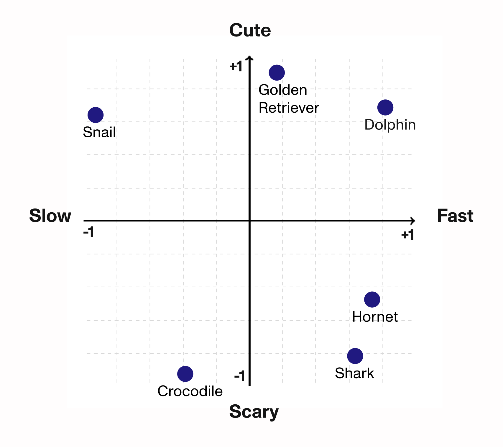
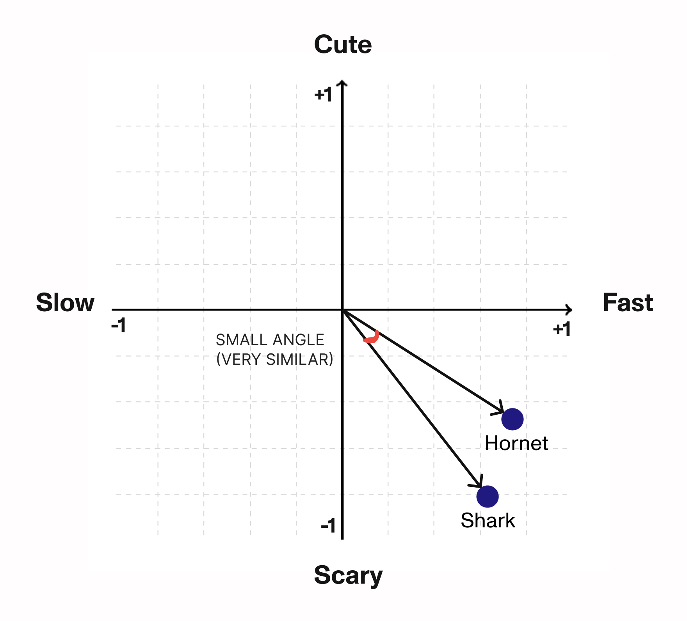
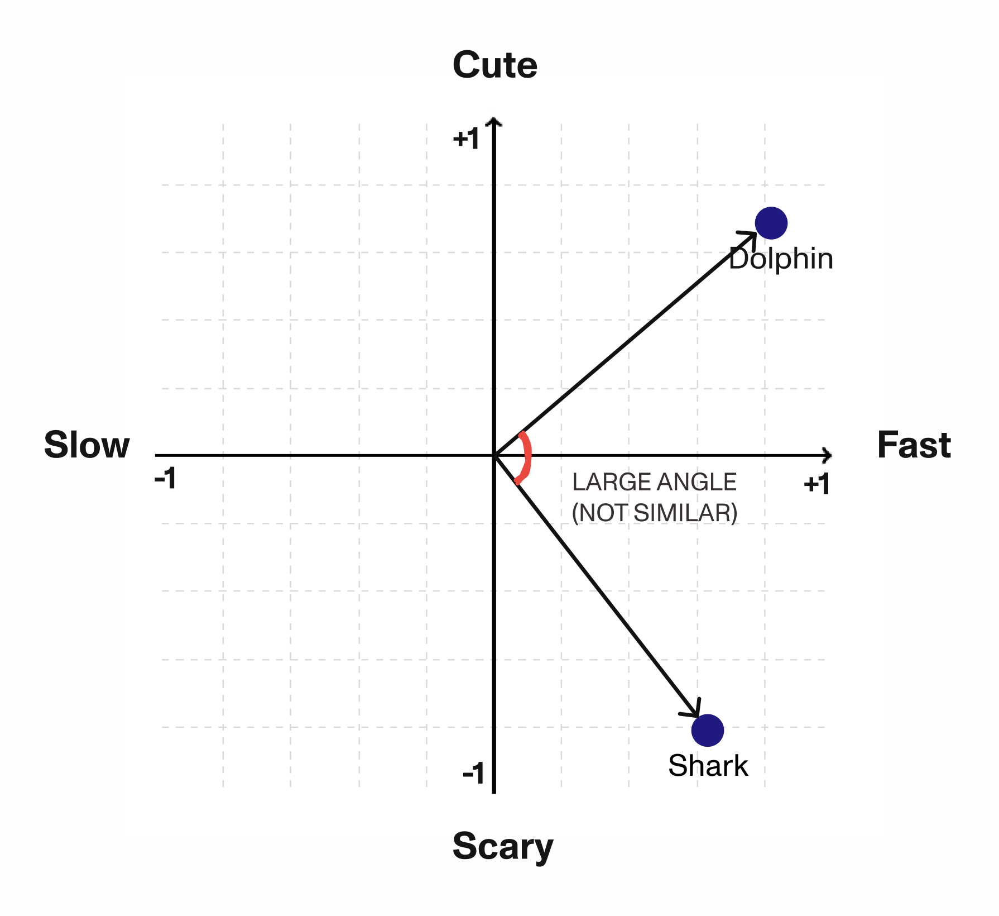
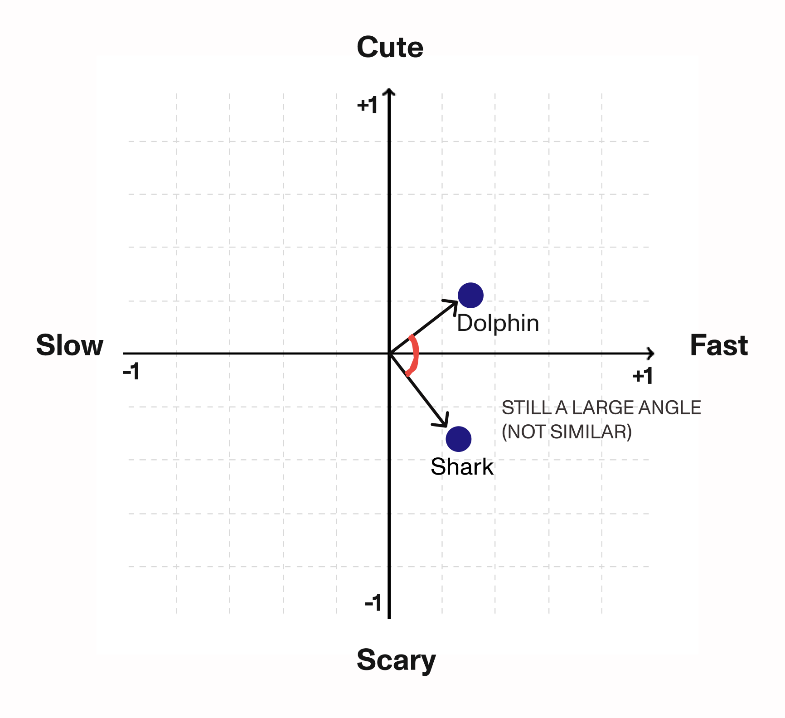

# Vector embeddings

Vector embeddings are basically a way to represent "things" as a series of numbers.



|Animal|Cute/Scary|Fast/Slow|
|---|---|---|
|Golden Retriever|+0.9|+0.1|
|Dolphin|+0.7|+0.8|
|Snail|+0.5|-0.8|
|Hornet|-0.5|+0.7|
|Shark|-0.8|+0.6|
|Crocodile|-0.9|-0.4|

Here we have a simple table where we only care about two dimensions. So how do we compare animals numerically — not just eyeball it? We can draw arrows from the origin to each point and look at the angle between them:


The smaller the angle between two points, the more similar they are. And the angle is easy to compute from a list of numbers — 

*You just take the (normalized) dot product between vectors (points), which gives you the cosine of the angle (a number between -1 and 1).A large cosine means a small angle; a small cosine means a large angle. So whichever comparison gives the largest number is the most similar.*

The larger the angle, the less similar the points are.



*Note that the angle doesn't care about the length of the arrows, only their direction**



*Why take the angle and not just the (euclidean) distance between points then? I'll get back to this.*

So if we wanted to find which animal is most similar to a Shark, we'd take the angle between Shark and every other animal, and call the one with the smallest angle the winner.

In this case, that's the Hornet. Which — when you picture a shark, "hornet" is probably not the first thing that comes to mind as similar. I think the dolphin would probably be most similar to shark overall. This is of course due to the fact we only care about how cute or fast the animals are. What if we added two more categories?

| Animal           | Cute/Scary | Fast/Slow | Land/Water | Large/Small |
| ---------------- | ---------- | --------- | ---------- | ----------- |
| Golden Retriever | +0.9       | +0.1      | +0.9       | +0.4        |
| Dolphin          | +0.7       | +0.8      | −0.9       | +0.6        |
| Snail            | +0.5       | −0.8      | +0.6       | −0.9        |
| Hornet           | −0.5       | +0.7      | +0.7       | −0.9        |
| Shark            | −0.8       | +0.6      | −0.9       | +0.8        |
| Crocodile        | −0.9       | −0.4      | +0.2       | +0.7        |

But wait... there are 4 dimensions here. In the previous example we could just take cute/scary as y and fast/slow as x, and compare the angle between them. How on earth do we visualize 4 dimensions? Let alone compare the angle between them?

Well, we don't visualize it — you can't visualize more than 3 dimensions intuitively. But we _can_ still compare the angle between 2 items. This is one of the great wonders of math: even though more than 3 dimensions are hard to reason about, the same simple operation that gives us the angle in 2D still works no matter how many dimensions you have.

All we need to do is compute the dot product between Shark and every other animal, and the highest result wins. Let's try it:


```python
import numpy as np

animals = {
    "Golden Retriever": [0.9, 0.1, 0.9, 0.4],
    "Dolphin":          [0.7, 0.8, -0.9, 0.6],
    "Snail":            [0.5, -0.8, 0.6, -0.9],
    "Hornet":           [-0.5, 0.7, 0.7, -0.9],
    "Shark":            [-0.8, 0.6, -0.9, 0.8],
    "Crocodile":        [-0.9, -0.4, 0.2, 0.7],
}


def cosine_similarity(a, b):
    a, b = np.array(a), np.array(b)
    # the dot product is just a single line of code
    return np.dot(a, b) / (np.linalg.norm(a) * np.linalg.norm(b))

shark = animals["Shark"]
scores = {k: cosine_similarity(shark, v) for k, v in animals.items() if k != "Shark"}
closest = max(scores, key=scores.get)

print(f"Closest to Shark: {closest} ({scores[closest]:.3f})")
```

If you're not familiar with Python, all this is doing is: compute the angle between Shark and every other animal, sort the results, and return whichever animal has the smallest angle (highest cosine).

Output:

```
Closest to Shark: Dolphin (0.510)
```

* Why angles instead of Euclidean distance? In high-dimensional spaces, distances stop being meaningful; everything ends up roughly the same distance from everything else. Angles don't have this problem. In fact, the more dimensions you add, the harder it becomes for two vectors to point in the same direction by sheer accident — so a small angle becomes an even stronger signal of genuine similarity.

So you can imagine: if we kept adding animals and some reasonable traits to separate them by, we could eventually map out the entire animal kingdom and compare any two animals in terms of "overall" similarity.

# Comparing companies

Great — so to compare the similarity of companies, all we need to do is the same thing, but for our list of companies, right? Just pick the best categories to separate them by, score each company on each category, and start comparing angles?

No. We don't have that kind of time. And even if we did, there's a much simpler way.

Embedding models are large AI models trained on basically every word known to mankind. Their job is to compare similarity between words, using the exact same approach we just walked through. Most good embedding models have somewhere between 1,000 and 5,000 dimensions — so somewhere between 1,000 and 5,000 categories to separate words by. What categories, you ask? No one really knows — the models learn to make up their own. But it's incredibly powerful. It's what every LLM, like ChatGPT, uses under the hood to tell words apart.

And the cool part is, it's not just words you can compare — you can feed it entire chunks of text and compare those.

Say we have 3 sentences:

```
Sentence 1: "Joe's Barber is a local barbershop offering traditional haircuts and shaves"

Sentence 2: "Cutters is a barbershop chain focusing on affordable, quick haircuts"

Sentence 3: "Szechuan Palace is a Chinese restaurant specializing in spicy regional cuisine"
```


Say our embedding model has 1024 dimensions. We feed all 3 sentences into it, and it spits out a list of 1024 numbers for each one.

```
Sentence 1: → [0.012, -0.045, 0.183, ..., 0.077]

Sentence 2: → [0.018, -0.039, 0.176, ..., 0.081]

Sentence 3: → [-0.091, 0.204, -0.012, ..., -0.033]
```

Now, to find which sentence is most similar to Sentence 1, we just compare the angle between Sentence 1's vector and the other two — same as before. Smallest angle wins. In this case, Sentence 2 comes out on top, which checks out.

*Shorter text generally produces cleaner embeddings — the more text you feed in, the more the vector gets pulled in different directions and loses focus. In practice though, most modern models handle paragraph-length descriptions well.*
